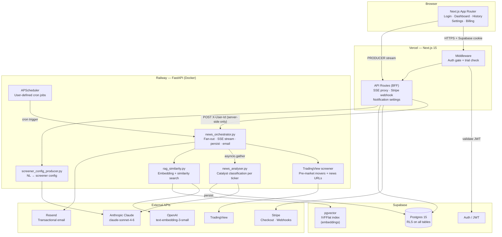
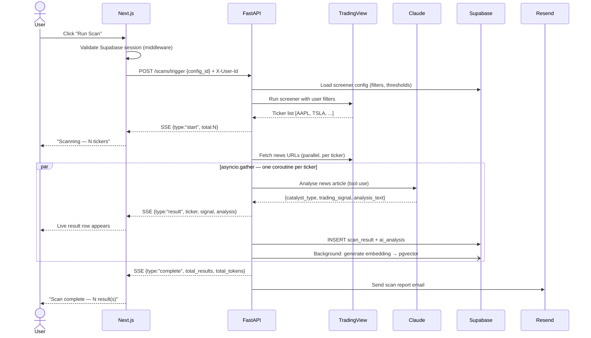
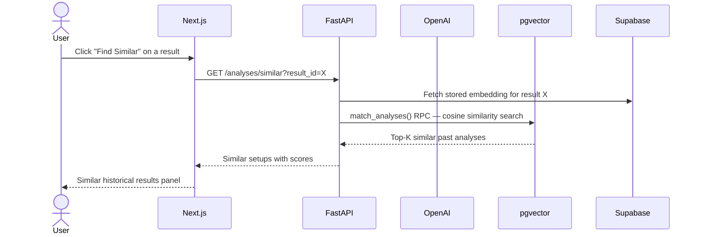
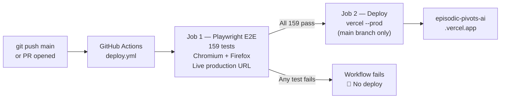

# AI Episodic Pivot

**Live:** [https://episodic-pivots-ai.vercel.app](https://episodic-pivots-ai.vercel.app) · [](https://github.com/jovmlads/episodic-pivots-ai/actions/workflows/deploy.yml)

## Overview

End-to-end intelligent AI system for analyzing pre-market stock movers, built around a multi-agent LLM pipeline and a full-stack web application.

The platform ingests market signals, classifies catalysts, streams structured outputs, and retrieves similar historical setups via RAG to support time-sensitive decision making.

## Architecture

The system architecture is designed with production constraints in mind:

- event-driven pipeline with clear agent boundaries
- cost-aware LLM orchestration and token usage controls
- evaluation layer for output quality and consistency
- fault isolation across agents and external services
- vector search tuned for retrieval accuracy and latency
- Stripe-based subscriptions with webhook-driven state sync
- row-level security (RLS) for multi-tenant data isolation

Built with a focus on practical trade-offs between latency, cost, and model accuracy — not just feature completeness.

---

## Problem

Retail traders need to know — before market open — whether a stock's gap is driven by a genuine fundamental catalyst (earnings beat, FDA approval, contract win) or is noise that will fade. Manual news review across 10–50 tickers in a 30-minute pre-market window is impossible at speed and scale.

## Solution

Episodic Pivot automates the full pipeline: screen TradingView for gap/pre-market movers against user-defined criteria → fetch news for each result → run parallel AI catalyst analysis → stream a structured report to the trader before the open. Historical results are stored with vector embeddings so the system surfaces comparable past setups via RAG search.

---

## Architecture & Rationale



**Why this split:**

- `tradingview-scraper` is Python-only — FastAPI owns all Python logic rather than shelling out from Node
- Next.js handles auth UI and proxies SSE server-side so the browser never holds API credentials
- Supabase is one platform for auth, data, vectors, and RLS — no separate identity provider or vector DB

### Data flow — scan pipeline



### RAG similarity flow



---

## System Design & Rationale

| Decision       | Choice                              | Rationale                                                                                  |
| -------------- | ----------------------------------- | ------------------------------------------------------------------------------------------ |
| AI parallelism | `asyncio.gather` per ticker         | Cuts analysis time from O(n×latency) to O(latency). 20 tickers ≈ same wall time as 1       |
| Streaming      | SSE (server-sent events)            | One-directional, HTTP/1.1 compatible, no WebSocket infra. Next.js proxies transparently    |
| Scheduling     | APScheduler in-process              | No Redis/Celery overhead for MVP. Jobs reload from DB on startup. Swap to Celery for scale |
| Embeddings     | OpenAI text-embedding-3-small       | 1536 dims, $0.02/1M tokens. Abstracts behind a service function — swappable                |
| RAG index      | pgvector IVFFlat (lists=100)        | Good recall/speed for <1M rows without separate vector DB. Upgrade to HNSW at scale        |
| Token control  | Per-user monthly budget in DB       | Prevents runaway cost per user without a separate billing micro-service                    |
| Auth boundary  | X-User-Id set server-side only      | FastAPI never exposed to browser. Auth validated by Next.js before proxying                |
| Trial/billing  | Stripe checkout sessions + webhooks | No custom payment logic. Webhook drives DB state — idempotent                              |

---

## Tech Stack & Selection Decisions

| Layer            | Technology                    | Version | Decision                                                                              |
| ---------------- | ----------------------------- | ------- | ------------------------------------------------------------------------------------- |
| Frontend         | Next.js (App Router)          | 15      | SSR for auth, native streaming support, Vercel zero-config deploy                     |
| Backend          | FastAPI                       | 0.115   | Async-native Python, OpenAPI docs, pydantic validation, fastest Python framework      |
| AI agents        | Anthropic SDK                 | 0.40    | Structured tool use (forces valid JSON output), native streaming, web_search tool     |
| Embeddings       | OpenAI text-embedding-3-small | —       | Cheapest high-quality embedding; pgvector-compatible 1536 dims                        |
| Database         | Supabase (Postgres 15)        | —       | pgvector built-in, Auth + RLS, instant REST/realtime, no self-host overhead           |
| Vector search    | pgvector                      | 0.3.6   | Embedded in Postgres — no separate infra, transactional consistency with data         |
| Scheduling       | APScheduler                   | 3.10    | In-process async scheduler, cron triggers, minimal infra. Swappable to Celery         |
| Scraping         | tradingview-scraper           | 0.3.9   | Only Python library with pre-market fields (premarket_change, premarket_volume, etc.) |
| Payments         | Stripe                        | 17      | Industry standard, Checkout Sessions handle PCI compliance, webhooks are reliable     |
| Email            | Resend                        | 2.4     | SPF/DKIM handled, generous free tier, dead-simple Python API                          |
| Containerisation | Docker + Compose              | —       | Reproducible local stack, Railway accepts Docker images directly                      |
| Deployment       | Vercel + Railway              | —       | Zero-ops. Vercel for Next.js native; Railway for Docker with env management           |

---

## Component Detail

---

### 1. TradingView Data Fetch (`apps/api/app/services/screener.py`)

**What it does:** Calls `tradingview-scraper` with user-defined filter rules (stored as JSONB in `screener_configs`). Returns structured `ScanResult` objects. News URLs fetched via the library's news module.

#### Tests

| Type        | What                                                           | Location                 |
| ----------- | -------------------------------------------------------------- | ------------------------ |
| Unit        | `_parse_rows()` with valid, empty, malformed input             | `tests/test_screener.py` |
| Unit        | `run_screener()` success + screener API failure                | `tests/test_screener.py` |
| Mock        | Screener class mocked — no live TradingView calls in CI        | `conftest.py`            |
| Integration | Live screener call with real cookie (manual, pre-market hours) | Run manually             |

#### Performance metrics

- Screener call: 1–3 s typical (TradingView API latency)
- News URL fetch: ≤200 ms per ticker (parallel in orchestrator)
- Runs in thread pool (`loop.run_in_executor`) — does not block FastAPI event loop
- Hard cap: `MAX_TICKERS_PER_SCAN` env var (default 20) limits downstream AI cost

#### Security

- `TRADINGVIEW_COOKIE` stored in env, never logged
- Library makes HTTPS-only calls
- No user input reaches the HTTP call — filters are validated by Pydantic before use

#### Error handling

- `run_screener()` raises `RuntimeError` on non-success screener response
- Orchestrator catches and yields `{"type": "error"}` SSE event — scan run marked `failed` in DB
- News URL fetch wrapped in try/except per ticker — failure silently falls back to web search

#### Scalability

- Stateless service — multiple FastAPI replicas can run concurrently
- Screener is rate-limited by TradingView — one call per scan run is the natural throttle
- For high user count: queue scan jobs via Celery + Redis (APScheduler → Celery swap, no logic change)

---

### 2. AI Layer (`apps/api/app/agents/`)

**Agents:**

- `news_analyser.py` — catalyst classification per ticker
- `news_orchestrator.py` — fan-out, SSE streaming, persist, email
- `screener_config_producer.py` — NL → validated screener config
- `rag_similarity.py` — embedding + pgvector similarity search

#### Tests

| Type        | What                                                           | Location                      |
| ----------- | -------------------------------------------------------------- | ----------------------------- |
| Unit        | Token tracker budget check, exhausted, 80% warning             | `tests/test_token_tracker.py` |
| Unit        | `_parse_rows`, `_extract_json` edge cases                      | `tests/test_screener.py`      |
| Integration | Live Claude call with real `ANTHROPIC_API_KEY` (manual)        | Run manually against staging  |
| Eval        | Catalyst classification accuracy on known fixtures (see below) | Manual eval suite             |

**AI Eval metrics** (run manually against a labelled set of 50 news articles):

| Metric                            | Target | Method                                                      |
| --------------------------------- | ------ | ----------------------------------------------------------- |
| Catalyst type accuracy            | ≥85%   | Compare model output vs human label on fixture set          |
| Signal correctness                | ≥80%   | `strong_buy`/`buy` on genuine catalysts, `skip` on dilution |
| False positive rate (noise → buy) | <10%   | Labelled "no catalyst" articles should return `skip`        |
| Dilution detection rate           | ≥95%   | ATM/direct offering articles must return `skip`             |
| Web search fallback recall        | ≥70%   | % of no-news tickers where search finds a valid reason      |
| Latency per ticker (p50)          | <5 s   | Measured via token usage logs                               |
| Latency per ticker (p95)          | <12 s  |                                                             |

Run eval:

```bash
# Place fixture JSON in tests/fixtures/catalyst_eval.json
# Format: [{"news_text": "...", "expected_catalyst": "earnings_beat", "expected_signal": "strong_buy"}]
cd apps/api && python -m pytest tests/test_eval.py -v
```

#### Performance metrics

- claude-sonnet-4-6 median latency: 2–4 s per ticker
- With 20 tickers in parallel: total wall time ≈ latency of slowest ticker (5–12 s)
- Token cost per ticker: ~800–1500 input + ~100–200 output tokens
- Embedding: ~50 ms per analysis (OpenAI API, background task)

#### Security

- `ANTHROPIC_API_KEY` and `OPENAI_API_KEY` in env, never logged or returned to client
- News article content capped at 8000 chars before sending to Claude — prevents prompt injection via malicious news content
- Claude tool-use schema enforces strict enum values — model cannot return arbitrary strings for `trading_signal`
- No user-supplied text reaches the AI prompt without being explicitly labelled as `user_input` in the prompt structure

#### Error handling

- Per-ticker analysis wrapped in `asyncio.gather(return_exceptions=True)` — one failure does not abort the scan
- Claude API errors caught in `_call_claude` → returns `AnalysisResult` with `catalyst_type="none"`, `trading_signal="skip"`
- Budget check before each ticker analysis — exhausted budget yields `{"type":"error"}` SSE event, not an exception
- Embedding generation is a background task — failure is logged but does not fail the analysis

#### Eval metrics tracking

Log these fields to `ai_analyses` table per call: `tokens_input`, `tokens_output`, `catalyst_type`, `trading_signal`, `web_search_used`. Run aggregate queries to track:

```sql
-- Signal distribution
select trading_signal, count(*) from ai_analyses group by 1 order by 2 desc;

-- Average token cost
select avg(tokens_input + tokens_output) as avg_tokens from ai_analyses;

-- Web search fallback rate
select avg(web_search_used::int) as fallback_rate from ai_analyses;
```

#### Scalability

- Agents are stateless async functions — horizontally scalable
- `asyncio.gather` parallelism scales to available concurrency (limited by Anthropic rate limits, not our infra)
- Anthropic rate limit: tier-dependent. For high volume, implement per-user request queuing with exponential backoff
- Embedding model is called once per analysis in a background task — throughput limited by OpenAI rate limits (10K RPM on free tier)

---

### 2b. AI Assistant Builder (`screener_config_producer.py`)

**What it does:** Accepts a plain-English description from the user and converts it into a validated `ScreenerConfig` JSON using Claude, streamed back as SSE.

#### Security

| Measure                     | Detail                                                                                                                                              |
| --------------------------- | --------------------------------------------------------------------------------------------------------------------------------------------------- |
| Authentication              | Supabase session validated by Next.js proxy before the request reaches FastAPI. `X-User-Id` is set server-side only — the browser never controls it |
| Input length limit          | `user_input` capped at 500 characters, enforced by Pydantic validator on the API and sliced at the frontend                                         |
| Control character stripping | Pydantic validator strips `\x00`–`\x1f` control characters from user input before it reaches the model                                              |
| Prompt structure            | User input is sent as the **user turn**, strictly separated from the system prompt — it cannot override or escape system instructions               |
| Output validation           | Only the `config` JSON object from Claude's response is ever parsed and persisted. Raw model output is never forwarded to the client or stored      |
| Rate limiting               | Per-user sliding window: 10 requests per 60 seconds, enforced in-process. Exceeding the limit returns HTTP 429                                      |

#### Prompt caching

The system prompt (field reference + instructions, ~1000 tokens) is marked with `cache_control: ephemeral` and sent with the `anthropic-beta: prompt-caching-2024-07-31` header. Anthropic caches the prompt for 5 minutes after first use.

- **Cost impact:** cached input tokens billed at ~10% of normal rate
- **Latency impact:** cache hits skip tokenising the system prompt, reducing time-to-first-token
- Cache is keyed per model version — invalidated automatically on model changes

---

**Schema:** `profiles`, `screener_configs`, `scan_runs`, `scan_results`, `ai_analyses`, `token_usage`, `notification_settings`

#### Tests

| Type      | What                                                                              |
| --------- | --------------------------------------------------------------------------------- |
| Migration | Apply both migrations to a fresh DB, verify schema                                |
| RLS       | Each policy tested: users cannot query other users' rows                          |
| Trigger   | `handle_new_user()` fires on `auth.users` insert, creates profile                 |
| RPC       | `match_analyses()` returns correct rows, respects `user_id_filter`, excludes self |
| Index     | `EXPLAIN ANALYZE` on vector similarity query — confirms IVFFlat index used        |

Run RLS tests via Supabase dashboard → SQL editor, or `supabase test db`.

#### Performance metrics

| Query                            | Target  | Notes                                        |
| -------------------------------- | ------- | -------------------------------------------- |
| `scan_results` insert (20 rows)  | <100 ms | Batch insert                                 |
| `ai_analyses` insert             | <50 ms  | Single row                                   |
| `match_analyses()` RPC           | <200 ms | IVFFlat on 100K rows                         |
| `scan_runs` list (user, last 20) | <30 ms  | Index on `(user_id, created_at desc)`        |
| `token_usage` upsert             | <20 ms  | Unique constraint on `(user_id, month_year)` |

Monitor slow queries via Supabase Dashboard → Database → Query Performance.

#### Security

- Row Level Security enabled on **all** tables — no table allows unfiltered access
- Service role key used only server-side (FastAPI + Next.js API routes) — never in browser
- Anon key scoped to Supabase Auth operations only
- `profiles.is_admin` not user-settable via RLS policies
- `SUPABASE_DB_URL` (direct Postgres connection) only used for migrations — not in application runtime
- pgvector embedding data contains no PII — only analysis text derived from public news

#### Error handling

- All DB calls in FastAPI wrapped in try/except — errors surfaced as 500 responses with logged detail
- Supabase client uses connection pooling — transient connection failures retry automatically
- Upserts used for `token_usage` and `notification_settings` — idempotent, no duplicate key errors

#### Scalability

- Supabase Pro supports connection pooling via PgBouncer (enable in Supabase dashboard)
- pgvector IVFFlat (`lists=100`) suitable for <1M rows. For >1M: switch to HNSW index (`using hnsw (embedding vector_cosine_ops)`)
- `scan_results` and `ai_analyses` will be the largest tables — add time-based partitioning if >100M rows
- Read replicas available on Supabase Pro for analytics queries (history page, similarity search)

---

### 4. Frontend / Backend (`apps/web/`)

**Next.js 15 App Router.** Pages: Login, Register, Dashboard (live scan), History, Screener Settings, Notifications, Billing. Backend: Next.js API routes act as BFF — auth validation + proxy to FastAPI.

#### Tests

**Unit / Component:**

```bash
# Add Vitest + React Testing Library for component tests
cd apps/web && npm install -D vitest @testing-library/react @testing-library/user-event
```

| Type      | What                                                       |
| --------- | ---------------------------------------------------------- |
| Component | `ScanDashboard` renders results table from mock SSE events |
| Component | `ScreenerSettings` menu form builds correct filter array   |
| Unit      | `formatPct`, `signalColor`, `isTrialActive` utilities      |
| Unit      | Middleware redirect logic (unauthenticated, trial expired) |

**E2E (Playwright):**

```bash
cd apps/web && npm test
```

| Test                                         | File                               |
| -------------------------------------------- | ---------------------------------- |
| Login page renders, unauthenticated redirect | `tests/e2e/auth.spec.ts`           |
| Invalid login shows toast error              | `tests/e2e/auth.spec.ts`           |
| Dashboard visible after login                | Add: `tests/e2e/dashboard.spec.ts` |
| Screener config save (menu)                  | Add: `tests/e2e/settings.spec.ts`  |
| AI chat returns streamed response            | Add: `tests/e2e/settings.spec.ts`  |
| History page shows past runs                 | Add: `tests/e2e/history.spec.ts`   |
| Billing redirect on expired trial            | Add: `tests/e2e/billing.spec.ts`   |

#### Performance metrics

| Metric                           | Target  | Method                                         |
| -------------------------------- | ------- | ---------------------------------------------- |
| Time to first byte (TTFB)        | <200 ms | Vercel Edge network                            |
| Dashboard page load (LCP)        | <1.5 s  | Next.js server components, no client waterfall |
| SSE first result latency         | <5 s    | From trigger click to first ticker result      |
| SSE total scan time (20 tickers) | <15 s   | Parallel AI analysis                           |
| Lighthouse performance score     | ≥85     | Run: `npx lighthouse https://your-domain.com`  |

Monitor via Vercel Analytics (enable in project settings).

#### Security

| Measure                  | Detail                                                                                |
| ------------------------ | ------------------------------------------------------------------------------------- |
| Auth                     | Supabase JWT, validated server-side in middleware and API routes                      |
| API credential isolation | `X-User-Id` set by Next.js API route — browser never calls FastAPI directly           |
| CSRF                     | Next.js App Router uses SameSite cookies — CSRF not applicable to API routes          |
| XSS                      | React escapes all rendered content. `dangerouslySetInnerHTML` not used                |
| Stripe                   | Webhook signature verified with `STRIPE_WEBHOOK_SECRET` before processing             |
| Secrets                  | All keys in server-side env vars. `NEXT_PUBLIC_*` contains only publishable keys      |
| Headers                  | Add `next.config.ts` security headers (CSP, HSTS, X-Frame-Options) for production     |
| Trial gate               | Middleware enforces trial/subscription check — cannot be bypassed by URL manipulation |

**Recommended security headers** (add to `next.config.ts`):

```ts
headers: async () => [
  {
    source: "/(.*)",
    headers: [
      { key: "X-Frame-Options", value: "DENY" },
      { key: "X-Content-Type-Options", value: "nosniff" },
      { key: "Referrer-Policy", value: "strict-origin-when-cross-origin" },
      {
        key: "Strict-Transport-Security",
        value: "max-age=63072000; includeSubDomains",
      },
    ],
  },
];
```

#### Error handling

- All `fetch` calls to FastAPI wrapped in try/catch — errors surfaced as `toast.error()`, never silent
- SSE consumer handles malformed JSON lines gracefully (try/catch per line)
- AbortController on scan SSE stream — user can cancel in-flight scan
- 401 from API route → redirect to `/login`
- 429 (budget exhausted) → clear user-facing message, not generic error
- Stripe checkout failure → cancel URL returns user to `/billing` with no broken state

#### Scalability

- Next.js on Vercel: auto-scales to zero, no cold start for edge middleware
- API routes are stateless — no shared memory between requests
- SSE proxy route streams directly — no buffering in Next.js, memory constant regardless of response size
- For >10K concurrent users: enable Vercel ISR for history/analytics pages, move heavy DB queries to FastAPI

---

## Deployment

### FastAPI → Railway

```bash
# Link project
railway link

# Deploy (uses apps/api/Dockerfile)
railway up --service api

# Set env vars
railway variables set ANTHROPIC_API_KEY=... SUPABASE_URL=... # etc.
```

Railway auto-deploys on push to `main` via GitHub integration.

### Next.js → Vercel

```bash
vercel --prod
```

Set env vars in Vercel project dashboard. Enable Vercel Analytics for performance monitoring.

### Supabase

```bash
# Apply migrations to production
supabase db push --db-url $SUPABASE_DB_URL
```

### Stripe webhook

Register endpoint in Stripe dashboard: `https://your-domain.com/api/webhooks/stripe`
Events to enable: `checkout.session.completed`, `customer.subscription.*`

---

## CI/CD

### Deployment gate — tests must pass before Vercel deploys



`.github/workflows/deploy.yml` — what it does:

1. Installs deps and Playwright browsers (Chromium + Firefox)
2. Runs `npm run test:prod` — all 159 tests against the live production URL
3. Uploads the HTML test report as a workflow artifact (kept 14 days)
4. **Only if tests pass and branch is `main`**: runs `vercel --prod` via CLI token

Vercel's GitHub integration is **disconnected** — production deploys only happen through this workflow.

#### Current status

| Component | State |
|---|---|
| Vercel GitHub auto-deploy | ✅ Disconnected |
| GitHub Actions workflow | ✅ Active — `.github/workflows/deploy.yml` |
| `VERCEL_TOKEN` secret | ✅ Set (repo-level) |
| `VERCEL_ORG_ID` secret | ✅ Set (repo-level) |
| `VERCEL_PROJECT_ID` secret | ✅ Set (repo-level) |
| Branch protection on `main` | ⬜ Optional — add to block direct pushes |

#### Optional: lock down `main` with branch protection

`GitHub repo → Settings → Branches → Add rule`:
- Branch name pattern: `main`
- ✅ Require status checks to pass before merging → add `Playwright E2E (production)`
- ✅ Do not allow bypassing the above settings

This prevents merging any PR that fails E2E and blocks direct pushes to `main`.

### Branch strategy

```
main        → production (deploys only after all 159 E2E tests pass)
feature/*   → PR → CI runs E2E → merge to main → deploy
```

---

## Local Development

```bash
cp .env.example .env
# Fill: SUPABASE_URL, SUPABASE_SERVICE_ROLE_KEY, SUPABASE_DB_URL,
#       ANTHROPIC_API_KEY, OPENAI_API_KEY, TRADINGVIEW_COOKIE,
#       STRIPE_SECRET_KEY, STRIPE_WEBHOOK_SECRET, STRIPE_PRICE_ID,
#       RESEND_API_KEY, API_SECRET_KEY

supabase db push   # apply migrations

docker compose up  # starts api:8000 + web:3000
```

API docs: [http://localhost:8000/docs](http://localhost:8000/docs)

**Run tests:**

```bash
# API
cd apps/api && pip install -r requirements.txt && pytest tests/ -v

# Web E2E
cd apps/web && npm install && npx playwright install chromium && npm test
```

---

---

## Frontend Testing

### Running the test suite

```bash
cd apps/web

# Against the live production deployment (3 browsers: Chromium, Firefox, Mobile)
npm run test:prod

# Against a local dev server
npm test

# Open interactive UI mode (local)
npm run test:ui
```

### Test suite summary (run: 2026-04-27, target: https://episodic-pivots-ai.vercel.app)

**159 tests · 3 browsers (Chromium, Firefox, Mobile Chrome) · 4 spec files**

| Suite | Tests | Passed | Status |
|---|---|---|---|
| `auth.spec.ts` — Auth flows & form validation | 42 | 42 | ✅ All pass |
| `navigation.spec.ts` — Routing & UI integrity | 27 | 27 | ✅ All pass |
| `performance.spec.ts` — Core Web Vitals & resource budget | 45 | 45 | ✅ All pass |
| `security.spec.ts` — Headers, XSS, access control | 45 | 45 | ✅ All pass |
| **Total** | **159** | **159** | **100% pass rate** |

---

### Performance results (live production, Chromium)

All metrics measured via the browser Navigation Timing and Paint Timing APIs against the Vercel CDN deployment.

| Metric | Measured | Threshold | Rating |
|---|---|---|---|
| TTFB (Time to First Byte) | **71 ms** | < 800 ms | ✅ Excellent |
| First Contentful Paint (FCP) | **468 ms** | < 1800 ms | ✅ Excellent |
| Largest Contentful Paint (LCP) | **488 ms** | < 2500 ms | ✅ Excellent |
| DOM Interactive | **380 ms** | < 2000 ms | ✅ Excellent |
| DOM Content Loaded | **380 ms** | < 2000 ms | ✅ Excellent |
| Full Page Load | **602 ms** | < 3000 ms | ✅ Excellent |
| Wall-clock load (Playwright) | **543 ms** | < 3000 ms | ✅ Excellent |
| Total transfer size | **187 KB** | < 1024 KB | ✅ Excellent |
| Network requests (login page) | **13** | < 30 | ✅ Excellent |
| Render-blocking resources | **1** (CSS) | < 3 | ✅ Pass |
| Mobile load time | **513 ms** | < 5000 ms | ✅ Excellent |
| No horizontal scroll (mobile 390px) | pass | — | ✅ Pass |

> Thresholds align with Google Core Web Vitals "Good" tier. DNS pre-connection is 0 ms — Vercel Edge Network handles geo-routing.

---

### Security audit results

Tests run against the live Vercel deployment (2026-04-27).

#### HTTP security headers

| Header | Status | Detail |
|---|---|---|
| `Strict-Transport-Security` | ✅ Pass | `max-age=63072000; includeSubDomains; preload` (2-year HSTS, preload-eligible) |
| `X-Content-Type-Options` | ✅ Pass | `nosniff` — set on all routes |
| `X-Frame-Options` | ✅ Pass | `DENY` — set on all routes |
| `Referrer-Policy` | ✅ Pass | `strict-origin-when-cross-origin` |
| `Permissions-Policy` | ✅ Pass | Camera, microphone, geolocation disabled |
| No server version leak | ✅ Pass | Response header `server: Vercel` — no version number |
| No sensitive data in headers | ✅ Pass | No API keys, secrets, or credentials in any response header |

#### Authentication & access control

| Test | Status |
|---|---|
| `/dashboard` unauthenticated → redirect `/login` | ✅ Pass |
| `/history` unauthenticated → redirect `/login` | ✅ Pass |
| `/settings` unauthenticated → redirect `/login` | ✅ Pass |
| `/billing` unauthenticated → redirect `/login` | ✅ Pass |
| `/` unauthenticated → redirect `/login` | ✅ Pass |
| `POST /api/scans/stream` without session → 401 | ✅ Pass |
| `POST /api/scans/stream` with forged `X-User-Id` header → 401 | ✅ Pass |

#### XSS prevention

All four payloads tested in both `email` and `password` fields on login and register pages.

| Payload | Result |
|---|---|
| `<script>alert('xss')</script>@test.com` | ✅ No execution |
| `" onerror="alert(1)` | ✅ No execution |
| `javascript:alert('xss')` | ✅ No execution |
| `` | ✅ No execution |

React's JSX rendering escapes all dynamic content — no `dangerouslySetInnerHTML` used.

#### Information disclosure

| Test | Status |
|---|---|
| Error pages do not expose stack traces | ✅ Pass |
| Source maps not publicly accessible (`/_next/static/*.js.map`) | ✅ Pass |
| Auth cookies have `Secure` flag on HTTPS | ✅ Pass |
| No raw JWT tokens in JS-accessible cookies | ✅ Pass |

---

### E2E test coverage

```
tests/e2e/
  auth.spec.ts        — login/register rendering, 4 protected route redirects,
                        3 error states, 4 form validation checks
  navigation.spec.ts  — page title, bidirectional link navigation, 404 handling,
                        HTML lang/dark-mode attributes, no broken images,
                        no console errors
  performance.spec.ts — FCP, LCP, TTFB, Navigation Timing, resource budget
                        (weight, request count, render-blocking), wall-clock
                        load, mobile viewport
  security.spec.ts    — 5 HTTP security header checks, 4 protected route
                        redirects, 2 API authorization checks, 4 XSS payloads,
                        cookie attribute inspection, source map & stack trace
                        disclosure checks
```

Run command:
```bash
cd apps/web && npm run test:prod
```

HTML report is written to `apps/web/playwright-report-prod/`. JSON results at `apps/web/test-results/prod-results.json`.

---

## Claude Code Skills (developer CLI)

| Skill                        | Usage                                        | What it does                           |
| ---------------------------- | -------------------------------------------- | -------------------------------------- |
| `/analyse TICKER [pct]`      | `/analyse AAPL 5.2`                          | Runs news analyser agent from terminal |
| `/screen "criteria"`         | `/screen "PM gainers >5% float <20M Nasdaq"` | NL → screener config                   |
| `/similar result_id user_id` | `/similar abc-123 user-456`                  | RAG similarity search                  |
